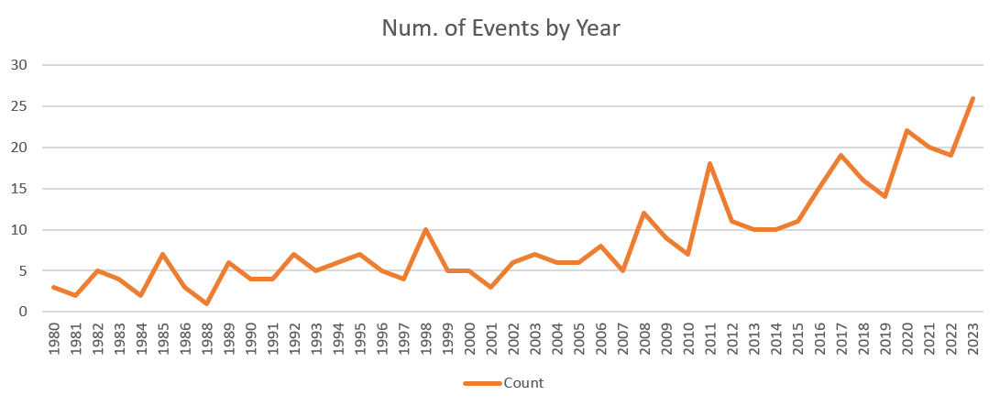

1. Which type of disaster is the most frequent?

    Severe Storm (188 events)

2. Are the total number of events increasing over time?

    Yes (See a2.xslx)
    

3. Which month has the greatest number of events?

    April (56 events)

4. Which type of disaster is responsible for the greatest number of deaths?
    
    Tropical Cyclone (6,897 deaths)

5. Which type of disaster is responsible for the greatest amount of destruction in dollars?

    Tropical Cyclone (1,404,717.8 millon USD)

6. Which individual event has been the deadliest?

    Hurricane Maria (September 2017 - 2,981 deaths)

7. Find the event that costed the most and determine the dollar value of its destruction per day.

    The event that costed the most was Hurricane Katrina (August 2005 - total cost 198,796.8 million). Its dollar value of destruction per day was 33,132.8 million USD/day.