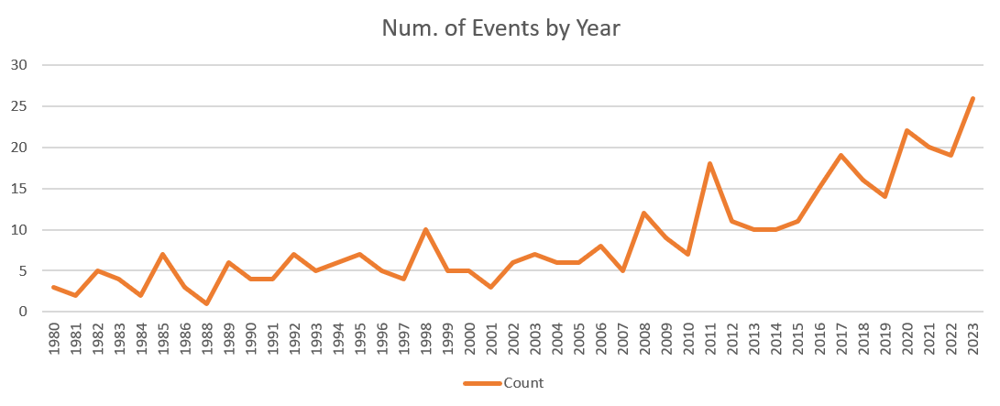

# Analysis of Weather Events for Insurance Decision Making

This is my submission for a Udacity project with the name mentioned above.

Tool used: **Alteryx Designer**

## Output

The outputs are stored in CSV files a1 through a7.csv. These CSV files are the bases for these analyses:

1. Which type of disaster is the most frequent?

    Severe Storm (188 events)

2. Are the total number of events increasing over time?

    Yes (See a2.xslx)
    

3. Which month has the greatest number of events?

    April (56 events)

4. Which type of disaster is responsible for the greatest number of deaths?
    
    Tropical Cyclone (6,897 deaths)

5. Which type of disaster is responsible for the greatest amount of destruction in dollars?

    Tropical Cyclone (1,404,717.8 millon USD)

6. Which individual event has been the deadliest?

    Hurricane Maria (September 2017 - 2,981 deaths)

7. Find the event that costed the most and determine the dollar value of its destruction per day.

    Hurricane Sandy (October 2012 - 43,901.85 million USD/day)	